

<picture>
  <source media="(prefers-color-scheme: dark)" srcset="./assets/images/stampfit-wordmark.png" />
  
</picture>

 
 

**세트·무게 없이, 운동한 날 도장 하나 찍는 운동 캘린더**

부위와 시간만 골라 10초 만에 기록하고, 기록이 쌓이면 잔디처럼 캘린더가 채워집니다.

 

 

&nbsp;
&nbsp;
&nbsp;

 

## 소개

운동 기록 앱은 대부분 세트, 무게, 횟수까지 입력해야 해서 며칠 쓰다 보면 기록 자체가 귀찮아집니다.
스탬핏은 **"오늘 운동했는지"** 에만 집중합니다. 운동한 부위와 시간만 고르면 기록이 끝나고, 그날 캘린더에 도장이 찍힙니다.

 

## 주요 기능

### 1. 10초 기록과 도장

  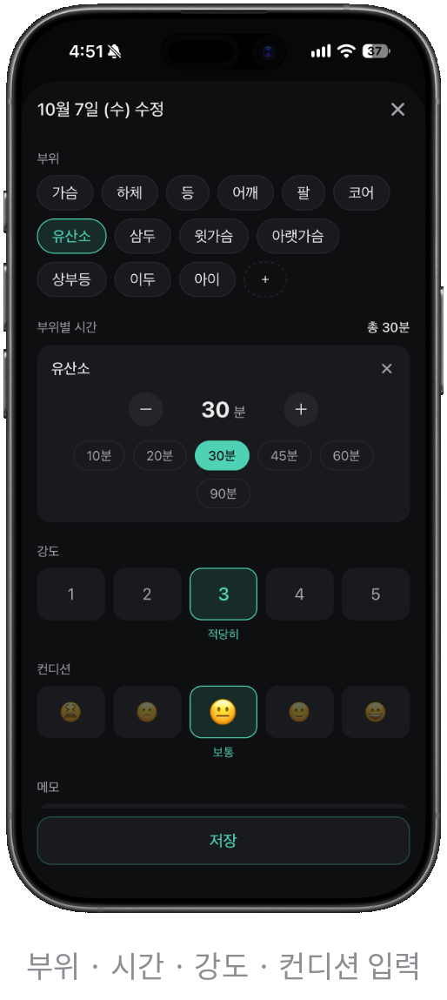&nbsp;&nbsp;
  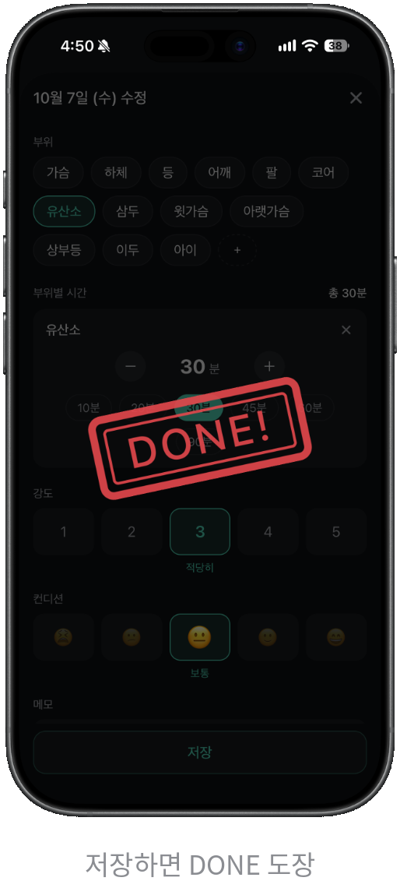

- 부위를 고르고 부위마다 시간만 정하면 기록이 끝납니다.
- 저장하는 순간 그날 캘린더에 도장이 찍히는 효과가 나옵니다.

### 2. 홈 — 주간 목표와 연속 달성

  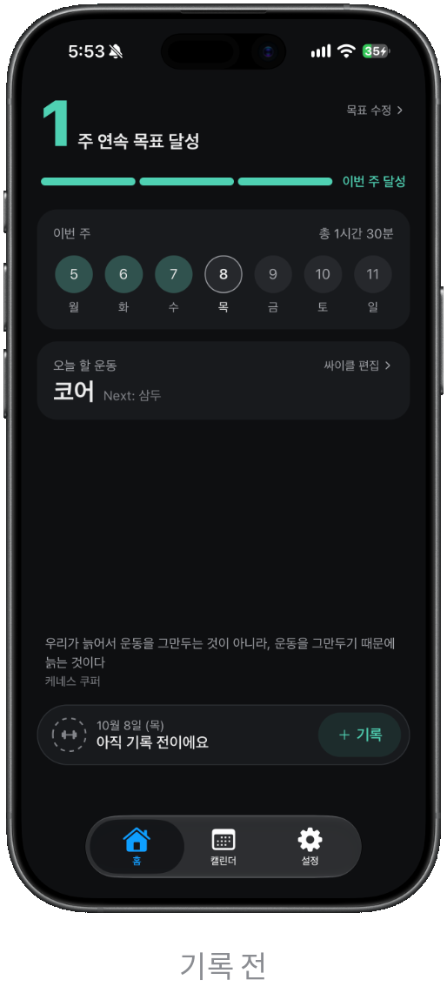&nbsp;&nbsp;
  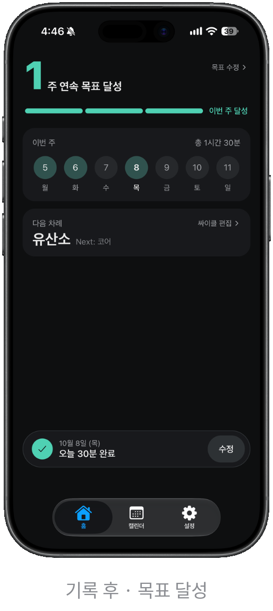&nbsp;&nbsp;
  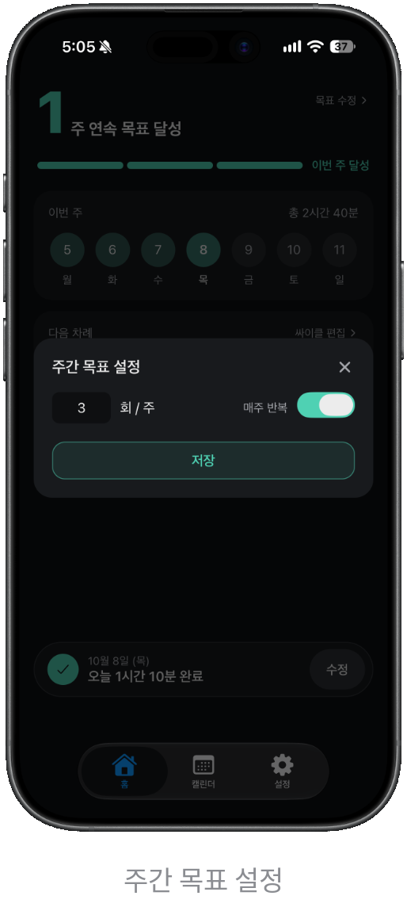&nbsp;&nbsp;
  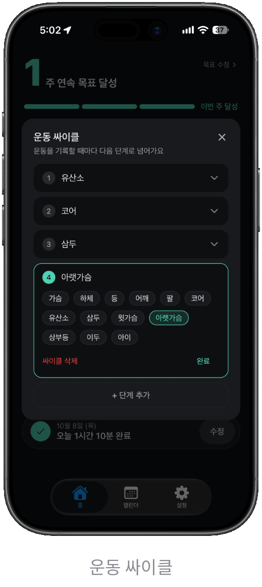

- 주 N회 목표를 정하면 목표를 채운 주가 몇 주 연속인지 보여줍니다.
- 운동 싸이클(예: 하체 → 가슴 → 등)을 정해두면 기록할 때마다 오늘 할 운동을 알려줍니다.

### 3. 캘린더 · 히트맵 · 통계

  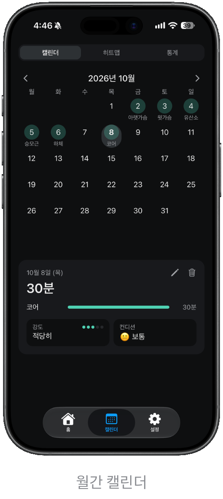&nbsp;&nbsp;
  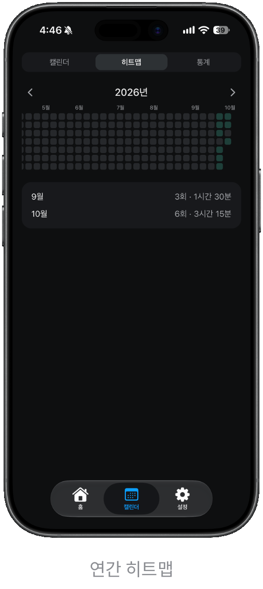&nbsp;&nbsp;
  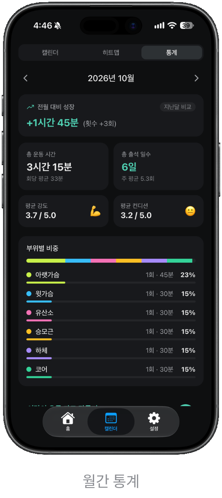

- **캘린더**: 날짜를 누르면 그날 기록을 보고 수정·삭제할 수 있습니다.
- **히트맵**: 1년치 기록을 깃허브 잔디처럼, 운동량이 많은 날일수록 진하게 표시됩니다.
- **통계**: 이번 달 운동량과 전월 대비 변화, 부위별 비중을 보여줍니다.

### 4. 월간 리포트 카드

  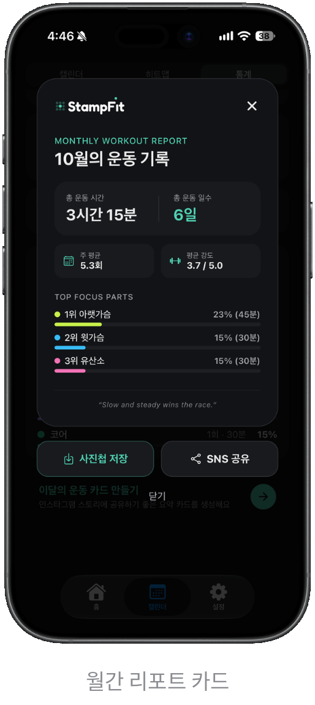

- 한 달 기록을 카드 한 장으로 정리해 사진첩에 저장하거나 SNS에 공유할 수 있습니다.

### 5. 부위 관리

  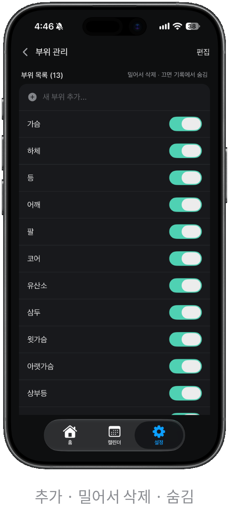&nbsp;&nbsp;
  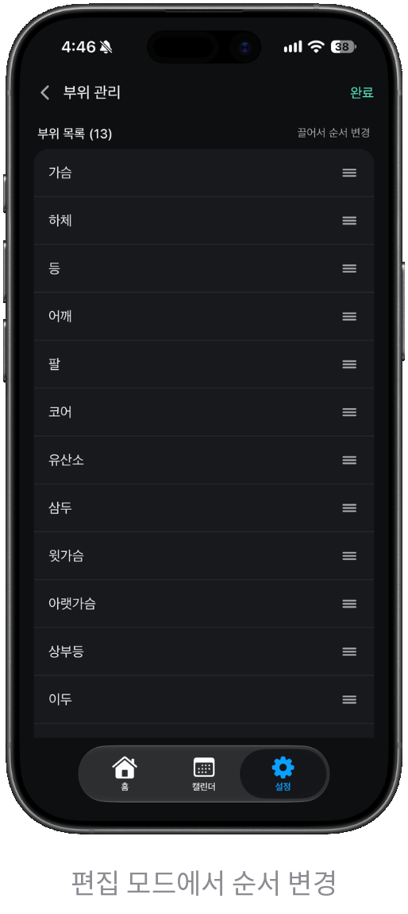

- 기본 7개 부위에 원하는 부위를 추가할 수 있고, 안 쓰는 부위는 꺼서 숨길 수 있습니다.

### 6. 홈 화면 위젯

  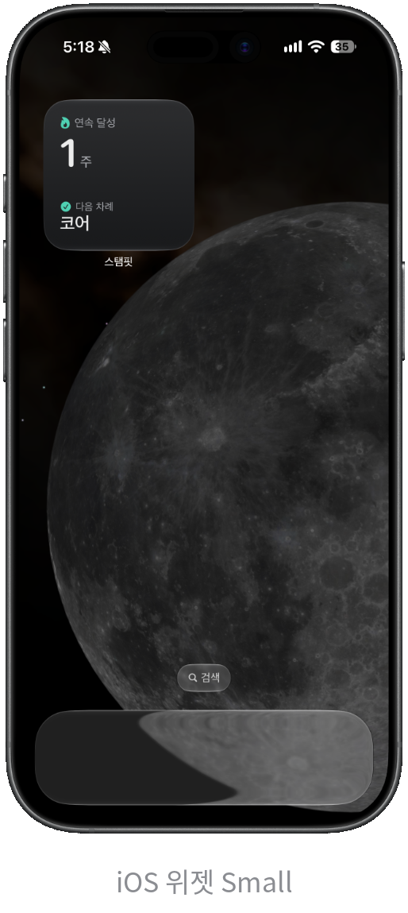&nbsp;&nbsp;
  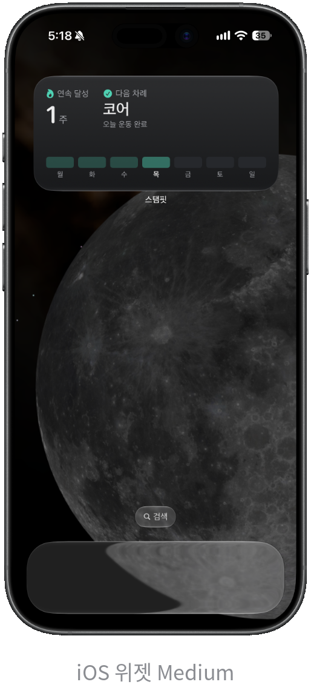

- 앱을 열지 않고도 연속 달성 주, 오늘 기록 여부, 다음 운동을 확인할 수 있습니다.
- iOS와 Android 모두 지원하며, Android 위젯은 Kotlin + Jetpack Glance로 직접 구현했습니다.

### 7. 로그인 · 계정

  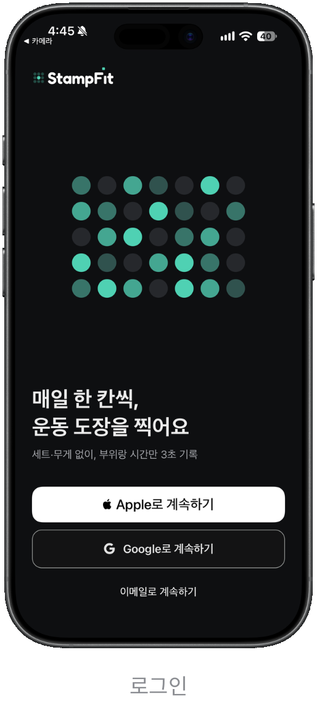&nbsp;&nbsp;
  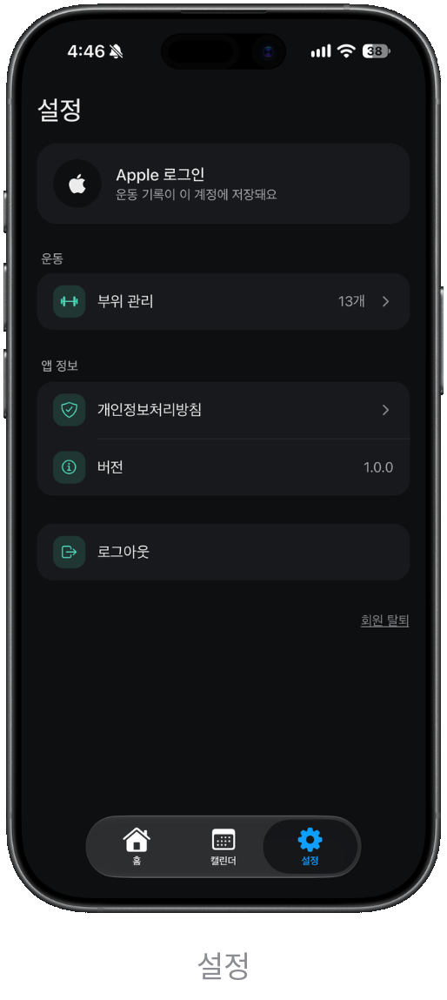

- Apple, Google, 이메일로 로그인할 수 있습니다.
- 기록은 기기에 먼저 저장된 뒤 계정으로 동기화되어, 오프라인에서도 쓸 수 있습니다.

 

## 기술 스택

| 구분 | 사용 기술 |
| --- | --- |
| Framework | Expo SDK 57, React Native 0.86, TypeScript 
| Navigation | Expo Router (iOS는 NativeTabs로 네이티브 탭 바 사용) |
| Styling | NativeWind (Tailwind CSS) |
| State | Zustand |
| Local DB | expo-sqlite |
| Backend | Supabase |
| Animation | React Native Reanimated , react-native-svg |
| Widget | iOS: expo-widgets + @expo/ui (SwiftUI) / Android: Jetpack Glance (Kotlin) |
| 기타 | react-native-view-shot, expo-sharing, expo-media-library, expo-haptics, burnt , react-native-draggable-flatlist |

 

