

<picture>
  <source media="(prefers-color-scheme: dark)" srcset="./assets/images/stampfit-wordmark.png" />
  
</picture>

 
 

**세트·무게 없이, 운동한 날 도장 하나 찍는 운동 캘린더**

부위와 시간만 골라 10초 만에 기록하고, 기록이 쌓이면 잔디처럼 캘린더가 채워집니다.

 

 

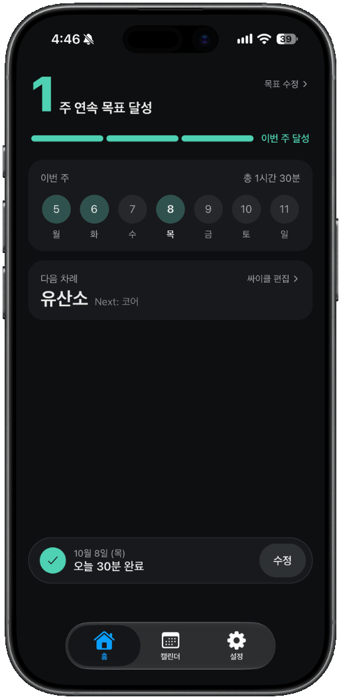&nbsp;
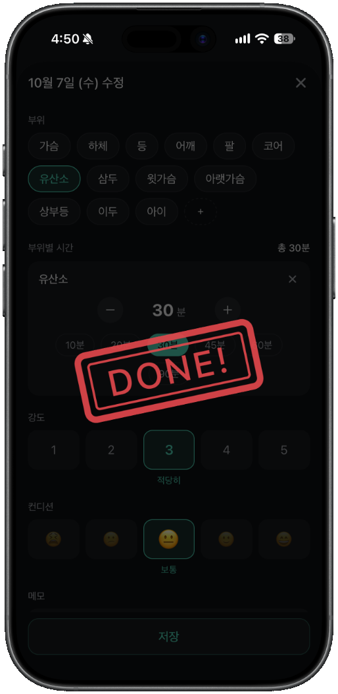&nbsp;
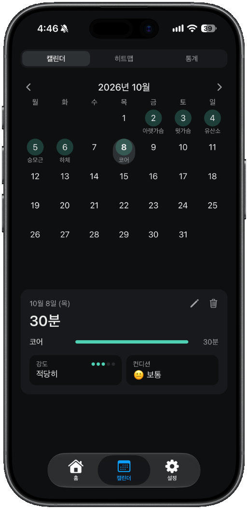&nbsp;
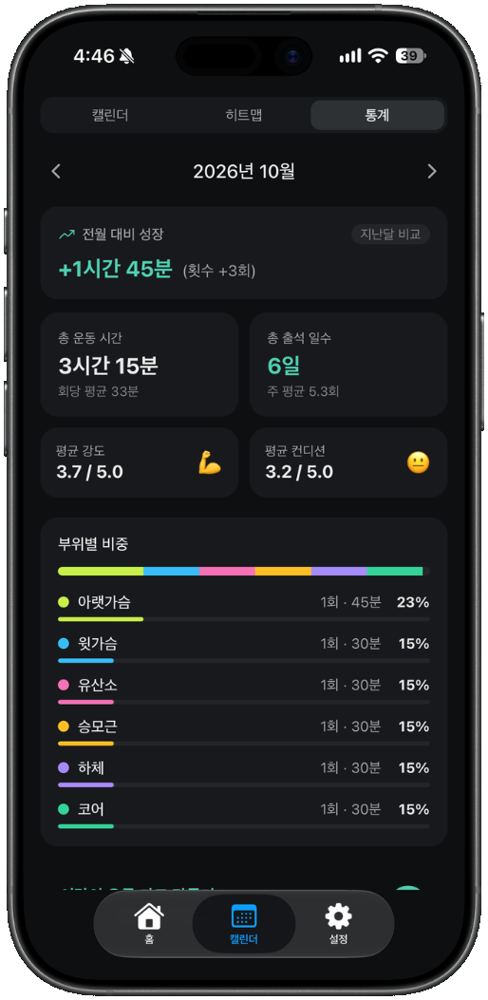

 

## 소개

운동 기록 앱은 대부분 세트, 무게, 횟수까지 입력해야 해서 며칠 쓰다 보면 기록 자체가 귀찮아집니다.
스탬핏은 **"오늘 운동했는지"** 에만 집중합니다. 운동한 부위와 시간만 고르면 기록이 끝나고, 그날 캘린더에 도장이 찍힙니다.

- 기록 항목은 부위, 부위별 시간, 강도, 컨디션, 메모가 전부입니다.
- 주간 목표를 정하면 목표를 채운 주가 연속으로 이어지는지 보여줍니다.
- 오프라인에서도 바로 기록되고, 온라인 연결 시 로그인한 계정으로 서버에 동기화됩니다.
- iOS / Android 홈 화면 위젯을 지원합니다.

 

## 주요 기능

### 1. 3초 기록과 도장

<table>
  <tr>
    <td align="center">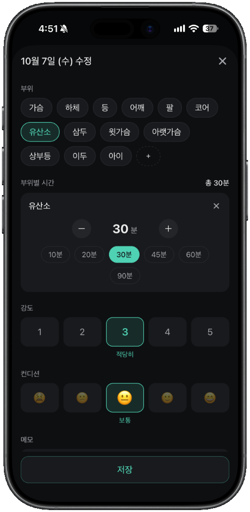</td>
    <td align="center"></td>
  </tr>
  <tr>
    <td align="center">부위 · 시간 · 강도 · 컨디션 입력</td>
    <td align="center">저장하면 DONE 도장</td>
  </tr>
</table>

- 부위 칩을 여러 개 고르고, 부위마다 시간을 따로 기록 (빠른 선택 10~90분, ±5분 조절)
- 강도 1~5단계, 컨디션 5단계 이모지, 자유 메모
- 날짜당 기록 1건. 이미 기록한 날을 열면 수정 화면으로 열림
- 저장 순간 도장이 찍히는 애니메이션 (react-native-svg + Reanimated)

### 2. 홈 — 주간 목표와 연속 달성

<table>
  <tr>
    <td align="center">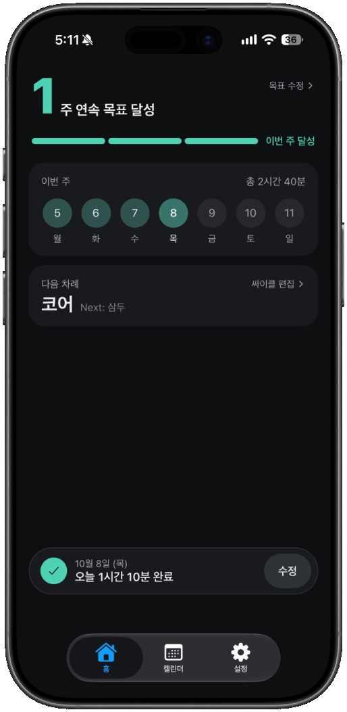</td>
    <td align="center"></td>
    <td align="center">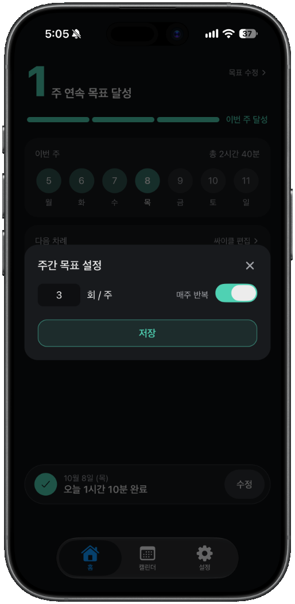</td>
    <td align="center">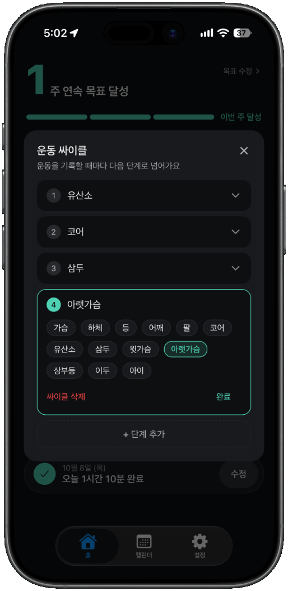</td>
  </tr>
  <tr>
    <td align="center">기록 전</td>
    <td align="center">기록 후 · 목표 달성</td>
    <td align="center">주간 목표 설정</td>
    <td align="center">운동 싸이클</td>
  </tr>
</table>

- **주간 목표**: 주 N회 목표를 정하고 "매주 반복" 여부 선택. 목표를 채운 주가 몇 주 연속인지 표시
- 목표를 바꿔도 지난주는 그 주에 설정했던 목표로 판정 (주별 목표 이력 저장)
- **운동 싸이클**: 하체 → 가슴 → 등처럼 분할 순서를 정해두면, 기록할 때마다 다음 단계로 넘어가며 오늘 할 운동과 다음 차례를 알려줌
- 이번 주 7일 잔디와 오늘 기록 상태, 기록 전에는 오늘의 운동 명언 표시

### 3. 캘린더 · 히트맵 · 통계

<table>
  <tr>
    <td align="center"></td>
    <td align="center">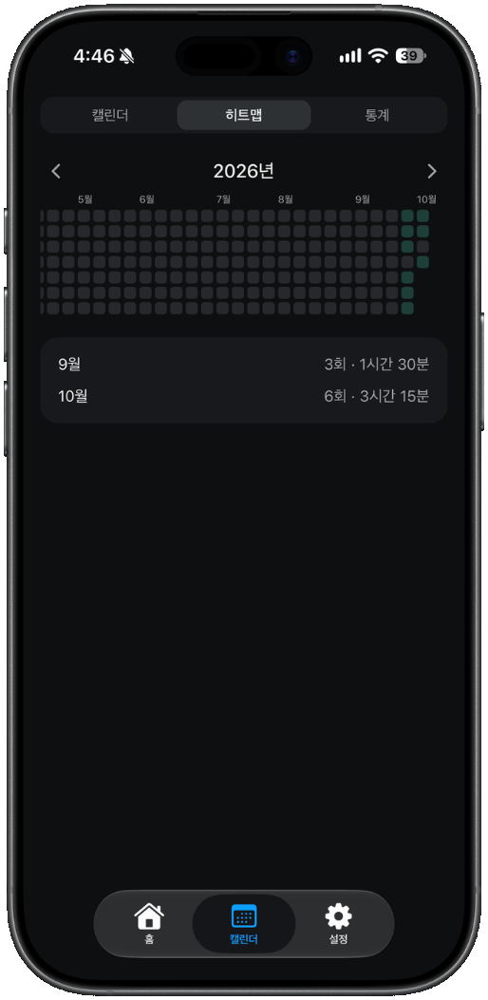</td>
    <td align="center"></td>
  </tr>
  <tr>
    <td align="center">월간 캘린더</td>
    <td align="center">연간 히트맵</td>
    <td align="center">월간 통계</td>
  </tr>
</table>

- **캘린더**: 스와이프로 월 이동, 날짜를 누르면 그날 기록(부위별 시간·강도·컨디션) 확인 및 수정·삭제, 지난 날짜 기록 추가
- **히트맵**: 1년치 기록을 깃허브 잔디처럼 표시. 강도 × 시간 점수로 4단계 농도 구분
- **통계**: 전월 대비 운동 시간, 총 운동 시간·출석 일수·주 평균 횟수, 평균 강도·컨디션, 부위별 비중

### 4. 월간 리포트 카드

<table>
  <tr>
    <td align="center">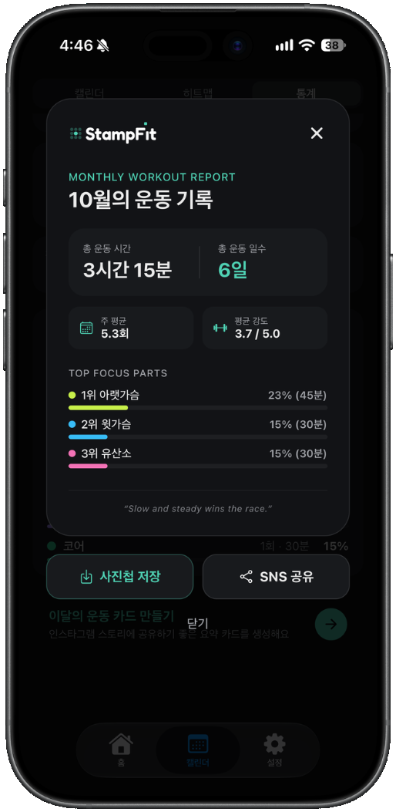</td>
    <td>
      <ul>
        <li>한 달 기록을 카드 한 장으로 요약 (총 운동 시간, 운동 일수, 주 평균, 평균 강도, TOP 부위)</li>
        <li>카드를 이미지로 캡처해 <b>사진첩 저장</b> 또는 <b>SNS 공유</b></li>
        <li>react-native-view-shot, expo-media-library, expo-sharing 사용</li>
      </ul>
    </td>
  </tr>
</table>

### 5. 부위 관리

<table>
  <tr>
    <td align="center">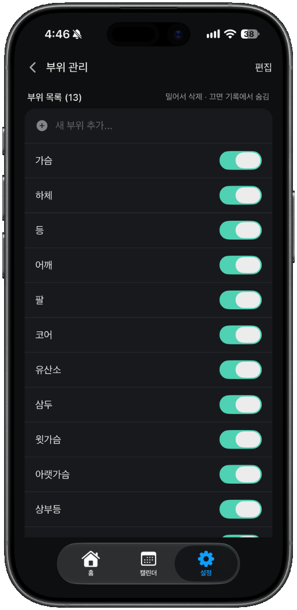</td>
    <td align="center">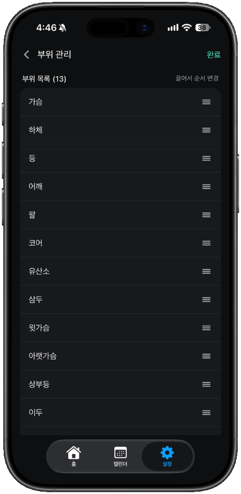</td>
  </tr>
  <tr>
    <td align="center">추가 · 밀어서 삭제 · 숨김</td>
    <td align="center">편집 모드에서 드래그로 순서 변경</td>
  </tr>
</table>

- 기본 부위 7개(하체, 가슴, 등, 어깨, 팔, 코어, 유산소)에 원하는 부위를 자유롭게 추가
- 끈 부위는 기록 화면에서만 숨겨지고 지난 기록은 그대로 유지

### 6. 홈 화면 위젯
<table>
  <tr>
    <td align="center">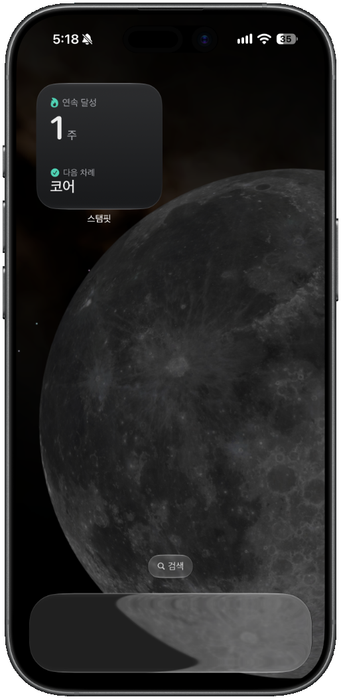</td>
    <td align="center">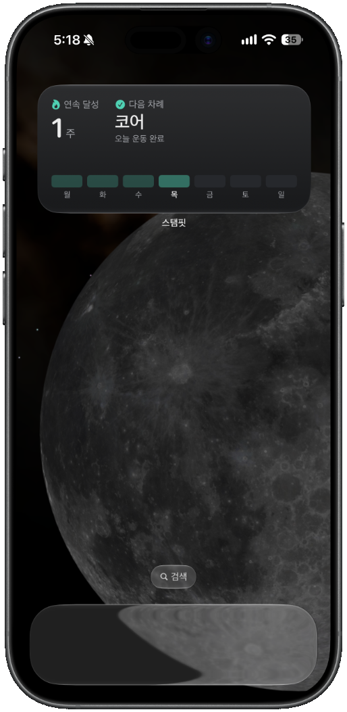</td>
  </tr>
  <tr>
    <td align="center">ios 위젯 small</td>
    <td align="center">ios 위젯 big</td>
  </tr>
</table>

- 앱을 열지 않고 연속 달성 주, 오늘 기록 여부, 오늘·다음 싸이클 단계, 이번 주 잔디를 확인
- iOS는 `expo-widgets` + `@expo/ui`(SwiftUI), Android는 **Jetpack Glance로 직접 만든 Expo 로컬 모듈**(`modules/workout-widget`)
- 3일치 타임라인을 미리 넘겨두어 앱을 열지 않아도 자정마다 위젯이 갱신됨

### 7. 로그인 · 계정

<table>
  <tr>
    <td align="center">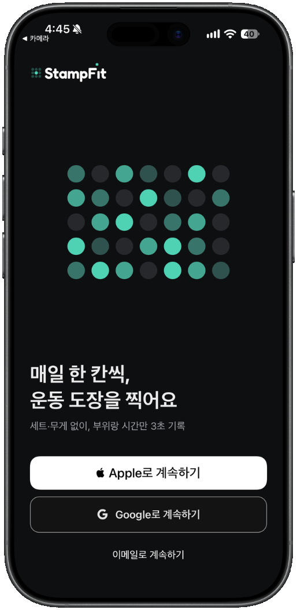</td>
    <td align="center">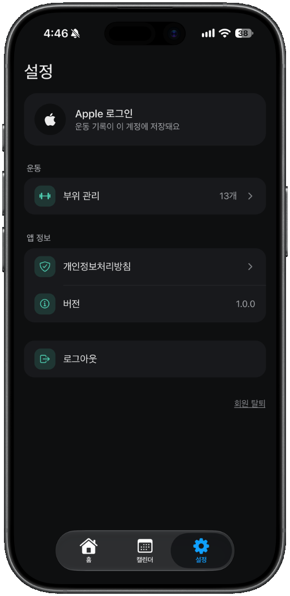</td>
  </tr>
  <tr>
    <td align="center">로그인</td>
    <td align="center">설정</td>
  </tr>
</table>

- Apple, Google, 이메일 로그인 (Supabase Auth)
- 로그아웃 전 서버에 아직 올라가지 않은 기록이 있으면 개수를 알려줌
- 회원 탈퇴 시 계정과 모든 운동 기록을 함께 삭제

 

## 기술 스택

| 구분 | 사용 기술 |
| --- | --- |
| Framework | Expo SDK 57, React Native 0.86 (New Architecture), React 19, TypeScript |
| Navigation | Expo Router (iOS는 NativeTabs로 네이티브 탭 바 사용) |
| Styling | NativeWind (Tailwind CSS) |
| State | Zustand |
| Local DB | expo-sqlite |
| Backend | Supabase (Auth, PostgreSQL, Row Level Security) |
| Animation | React Native Reanimated 4, react-native-svg |
| Widget | iOS: expo-widgets + @expo/ui (SwiftUI) / Android: Jetpack Glance (Kotlin) |
| 기타 | react-native-view-shot, expo-sharing, expo-media-library, expo-haptics, burnt (네이티브 토스트), react-native-draggable-flatlist |

 

